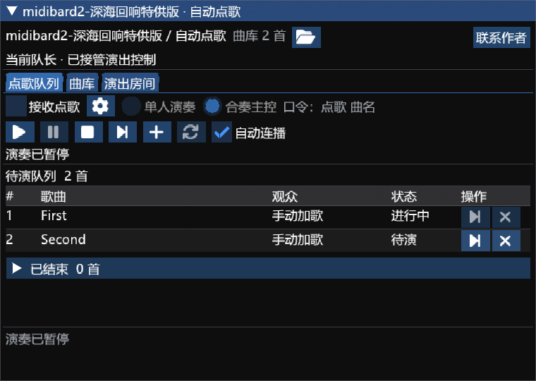

# midibard2-深海回响特供版

FF14 / 卫月（Dalamud CN）演奏插件，基于 [reckhou/MidiBard2](https://github.com/reckhou/MidiBard2) 的 `v3-api15-stable` 分支开发。本仓库维护深海回响定制版源码、安装索引及版本发布。

当前版本 **3.2.5.18**，Dalamud API 15，Windows x64 / .NET 10。作者署名：akira0245, Ori, Kalle, Zune, 断水剑, SevenCat。

基于midibard2的魔改版本，添加自动点歌、歌单、控制台、不同IP连接功能。

本插件基于midibard2开源代码魔改制作，完全免费，旨在打造一个更低门槛、更有活力的游戏演奏环境。

已安装旧版的用户，刷新卫月插件仓库后可直接更新至 **3.2.5.18**。开发插件用户请停用旧版，完整解压 [3.2.5.18 安装包](https://github.com/Alittlerecallinglittlebrother/MidiBard2-Deepsea/releases/download/v3.2.5.18/MidiBard2.zip)，重新指定其中的 `MidiBard2.dll`。不要同时启用多个版本。

## 安装

在卫月设置的自定义插件仓库中添加：

```text
https://raw.githubusercontent.com/Alittlerecallinglittlebrother/MidiBard2-Deepsea/main/repo.json
```

保存后在插件安装器搜索 **midibard2-深海回响特供版**。本版与原 MidiBard2 共用 `MidiBard2` 内部标识，先停用原版或旧开发版，避免同时启用两个版本。若旧合集仓库也提供 MidiBard2，请确认安装器显示本仓库地址和版本；本次独立发布不修改旧合集索引。

手动安装使用 [最新 Release](https://github.com/Alittlerecallinglittlebrother/MidiBard2-Deepsea/releases/latest) 的 `MidiBard2.zip`，完整解压后在卫月开发插件设置中添加 `MidiBard2.dll`。其余 DLL 是依赖，保留在同一目录。升级前备份原有插件配置。

## 功能

- 观众在选定频道发送 `点歌 曲名` 后排队；共享原 MidiBard 曲库，支持拖动排序、单曲删除及清空。
- 单人演奏与合奏主控，歌曲播放、暂停、停止、自动连播、接收点歌分别控制。
- 按有效音轨的中文或英文名字识别乐器，按队长屏幕上的小队显示顺序分配演奏人。
- 主持人无需入队，可通过共享房间查看和调整队列；普通队员使用查看邀请。
- 转让游戏队长时接管演奏权限，保留房间、主持人连接和队列。原房主仍须在线、留在同一小队并保持樱花隧道运行。
- 节目单、演出记录及导出；主窗口和自动点歌窗口提供“联系作者”按钮。

全队需预先备齐相同 MIDI，演出房间不传输歌曲文件。多设备合奏须开启 PMD 和合奏监听，候任队长须提前加入原房间。详见 [使用说明](STAGE-README.md)、[演出房间与自动接管](STAGE-ROOM.md) 和 [状态接口](STAGE-IPC.md)。



## 3.2.5.18 更新

自动点歌窗口顶部增加开源来源与完全免费说明，宽度足够时显示在标签栏右侧，窄窗口或放大字体时在标签栏下方自动换行。更新安装器中的插件介绍，作者列表保留 SevenCat。

演奏逻辑沿用 3.2.5.17，不含实验性演奏中换乐器功能。本次界面检查使用独立原生 ImGui 宿主，未在游戏内加载验证。详见 [验证记录](STAGE-VERIFICATION.md)。

## 构建

安装 .NET SDK 10 和 Dalamud API 15 开发文件后运行：

```powershell
./build-stage.ps1 -DalamudLibPath "$env:APPDATA/XIVLauncherCN/addon/Hooks/dev"
```

脚本运行核心、播放、界面、房间、自动分配及小队载入检查后编译。已有验证结果时，可使用 `-SkipChecks` 仅构建插件。输出位于 `Midibard/bin/Release`。`build-dev.ps1` 用于独立开发目录，`package-stage.ps1` 用于打包插件、源码和校验清单。

## 联系与许可

- 联系作者：https://shenhai.meoo.zone/
- 问题反馈：[Issues](https://github.com/Alittlerecallinglittlebrother/MidiBard2-Deepsea/issues)
- 完整源码：本仓库及每个 Release 的 `MidiBard2-source.zip`。

遵循 [GNU AGPL v3 或后续版本](LICENSE)。保留原作者、贡献者及 [第三方许可说明](Stage/THIRD-PARTY-NOTICES.txt)。原 MidiBard 代码由 akira0245 编写并最初用于 MidiBard 项目。本版基于上游提交 `d8d1bd4454604cc837affd593fc3b982f33433e7`，深海回响定制修改由断水剑维护；2026-09-19 发布独立仓库。上游说明保存在 [README-upstream.md](README-upstream.md) 和 [README - CN.md](README%20-%20CN.md)。分发修改版时须提供相应源码并保留许可与署名。
